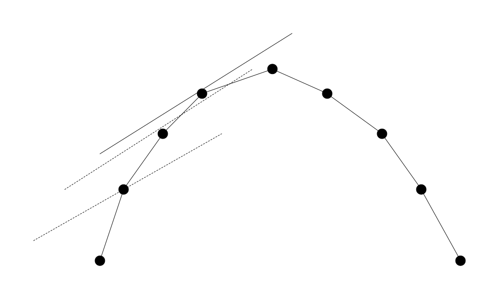

## 简介

wqs 二分，最早在 2012 年由王钦石在其集训队论文中提出，后因 IOI 2016 中的题目 Aliens 使用了这一算法而闻名，因此这一算法也被称为「Alien's trick」。

wqs 二分能解决带有以下特征的题目：

-   求恰好取得 $k$ 个物品时的最优答案 $f(k)$
-   $f(k)$ 较难直接求得，但容易求得无限制时的最佳答案
-   $f$ 具有凸性

## 原理

我们把所有 $(x, f(x))$ 画出来，由于 $f$ 有凸性，它们构成了一个凸包。我们不妨只讨论上凸，也就是斜率递减的情况，其余的情况是类似的。

我们考虑二分一条直线的斜率 $p$，然后用这条直线去切这个凸包。因为 $f(x)$ 有凸性，切到的点关于 $p$ 是单调的，因此我们可以通过不断调整 $p$ 使得这个直线切在 $(k, f(k))$ 上，然后即可快速求得答案。现在问题转化为如何快速求得这条直线在凸包上切在哪个位置。



由于我们并不知道凸包的具体结构，考虑继续转化问题。考虑在凸包上每个点，切到的点一定使得这条直线过这个点时在 $y$ 轴上的截距最大。不妨设直线过 $(x, f(x))$ 上，则直线的截距为 $b = f(x) - px$，我们要最大化这个东西。

由于 $f(x)$ 是恰好选择 $x$ 个时的最大收益，那么后面的 $- px$ 一项可以看作是每次选择都要额外扣除 $p$ 的权值。也就是说，我们实际要做的就是给每个物品扣除 $p$ 的权值，然后在没有约束条件的情况下求得最优时选择的数量，此时得到的就是斜率为 $p$ 交到的点的横坐标，此时求得的最佳答案只需要把调整的总共 $px$ 权值加回去就能得到答案。

但有些情况下，凸包上会有连续几个点共线的情况（或者说某些 $(x, f(x))$ 没有成为凸包的顶点而是在凸包的边上），这时被夹在中间的点无论如何都无法成为切点。这种情况怎么处理呢？

我们考虑切线与凸包上多点共线这种情况意味着什么：

-   连续几个物品的权值相等；
-   这几个物品调整后权值恰好都为 $0$。

这时我们发现这几个物品在调整是“无意义”的，可选可不选；而因此这几个位置在调整后求出的答案是相同的，于是两侧的点的答案可以直接拿来用，只需要加上正确的 $kp$ 即可。

代码实现上，由于我们很难判断是否有共线的情况出现，我们可以钦定“无意义”的的物品都选中，并且每次选择的物品数大于 $k$ 就更新答案。注意这里更新答案要加的是 $kp$ 而不是当前点 $x$ 对应的 $px$。

## 例题

### [P5633 最小度限制生成树](https://www.luogu.com.cn/problem/P5633)

??? note "题意"
    给定一张带权无向联通图，求得一个生成树，满足节点 $s$ 度数恰好为 $k$，且边权总和最小。

我们首先证明问题具有凸性。考虑一个没有实际实现意义的算法，假设我们已经求得了 $s$ 度数为 $k - 1$ 的最小生成树，那么我们每次选择 $s$ 连出去的，没有构成生成树的边中选择一个，设其权值为 $w_1$，把它强行加到树上，这时树上出现了一个环，我们再删掉这个环上除刚刚加入的这条边外权值最大的一条边 $w_2$，每次都选择 $w_1 - w_2$ 最小的一个。能选的边是不断减少的，如果这次能选择这对边，那上一次一定也可以，因此不难发现每次的 $w_1 - w_2$ 是不增的，因此发现问题具有凸性。

因此我们可以使用 wqs 二分。每次将所有和 $s$ 相连的边权值减去 $p$，然后把所有边一起跑一遍 Kruskal，根据得到的生成树中 $s$ 的度数继续二分即可。

??? note "参考代码"
    ```c++
    --8<-- "docs/dp/code/opt/wqs/wqs_1.cpp"
    ```

### [Tree I](https://www.luogu.com.cn/problem/P2619)

??? note "题意"
    给出一个无向带权连通图，每条边是黑色或白色。求一棵最小权的恰好有 $need$ 条白色边的生成树。

凸性的证明思路和最小度限制生成树类似。首先对于每个白边 $(u, v, w)$，考虑新增一条黑边 $(u, v, +\infty)$，防止白边过少时无法得到生成树。考虑当前有 $k - 1$ 条白边的生成树，现在要强行加进去一个白边，设其权值为 $w_1$，这使得原来的生成树上多出来一个环，我们选这个环上所有黑边中权值最大的一个删掉，设其权值为 $w_2$。我们每次要选择加入后构成的环中有黑边，且权值增量 $w = w_1 - w_2$ 最小的一个白边。不难发现这两个限制随着白边的加入都是越来越紧的——第 $k$ 次未加入生成树的白边第 $k + 1$ 次可能加入了，第 $k$ 次存在的黑边第 $k + 1$ 次可能不存在。

因此如果第 $k + 1$ 次加入时的增量小于 $k$ 次，那一定可以交换 $k, k + 1$ 次的选边方案使得第 $k$ 次更优，因此加入白边后的权值增量不增，故该问题有凸性，可以用 wqs 二分解决。

于是二分一个增量，每次将所有白边权值加上这个增量，再和黑边一起跑最小生成树，根据最小生成树中白边的数量调整增量即可。

??? note "参考代码"
    ```c++
    --8<-- "docs/dp/code/opt/wqs/wqs_2.cpp"
    ```
